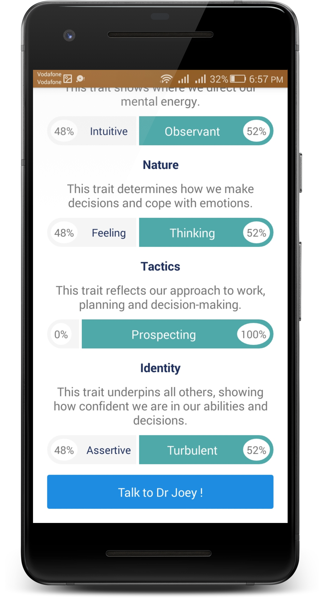
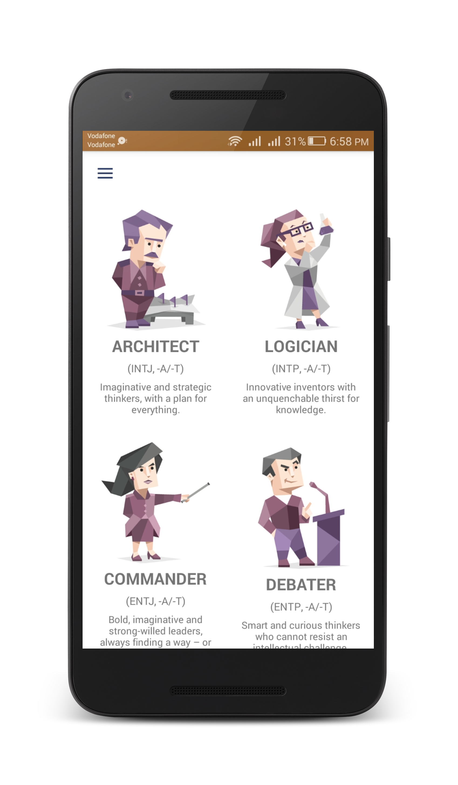

# Dr-Joey

Screenshots
-------------

    
   
  
 
 
  

## Description:

### Dr. Joey is :
A Psychotherapist Chatbot trying to help his friends through talking freely about their problems so they can listen to themselves and figure out their solutions with Dr. Joey. Dr. Joey as a Chatbot make his friends feel comfortable while talking because he will not judge them like humans do. Users take a personality test so Dr. Joey can define their personality type, and for fun we designed characters to describe their type and can see who looks like him from famous celebrity, movies and series characters. User can follow the progress or delay his / her condition through his history page, which will present his parentage of happiness and sadness and normal status through his session.


### Our goal is:
To be friends with our users and help them through their problems. We suggested mobile application as it is more usable and common to people and comfortable in chatting than a website, and we used API AI website platform to help us in categorizing dialogs, responses and phrases.


## Libraries and Tools
- Firebase (Database - Cloud Functions - Storage)
- Picasso
- Navigation Drawer
- Fragments and Activities
- Recycler View
- Shared Preferences
- Retrofit (Parsing JSON)


## License

* [Apache Version 2.0](http://www.apache.org/licenses/LICENSE-2.0.html)

```
Copyright 2018 Ali Ussama

Licensed under the Apache License, Version 2.0 (the "License");
you may not use this file except in compliance with the License.
You may obtain a copy of the License at

 http://www.apache.org/licenses/LICENSE-2.0

Unless required by applicable law or agreed to in writing, software
distributed under the License is distributed on an "AS IS" BASIS,
WITHOUT WARRANTIES OR CONDITIONS OF ANY KIND, either express or implied.
See the License for the specific language governing permissions and
limitations under the License.
```
